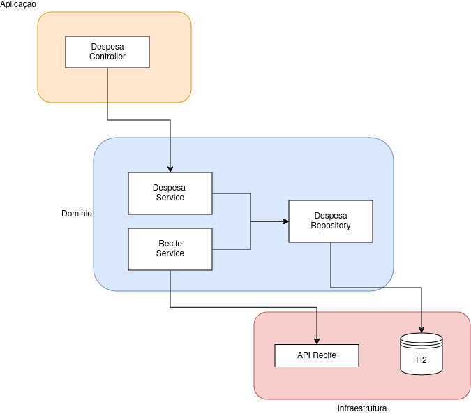

# Avaliação Dev Java **7pay**

Nesse projeto foi criado uma API RESTful que permite a navegação e manipulação dos dados de despesas orçamentárias da 
cidade de Recife. Para o escopo desse projeto, limitamos os dados aos 100 primeiros gastos do ano de 2017 retornados 
pela API disponibilizada. Mais informações sobre os dados podem ser encontrados no 
[portal de dados abertos de Recife](http://dados.recife.pe.gov.br/dataset/despesas-orcamentarias/resource/d4d8a7f0-d4be-4397-b950-f0c991438111).

# Arquitetura

Como pode ser visto na imagem acima, o sistema foi divido em três camadas, a Aplicação, o Domínio e a Infraestrutura. Na 
Aplicação, temos o `controller`, responsável por criar os endpoints e manter a API. No domínio temos toda a lógica do
sistema, ficando responsável por todas as funções de gerenciamento e armazenamento de dados. Já a Infraestrutura é
responsável pelo acesso a sistemas externos, como a API de Recife, e o banco de dados.

Para o download dos dados de despesas orçamentárias, foi criado um `Listener` que é executado sempre que o sistema
inicia. Como estamos usando um banco de dados em memória, os dados não são salvos entre execuções e o download é feito
toda vez que o sistema inicia. A única exceção é quando estamos executando os testes, nesse caso nada é baixado.

# Tecnologia
Foram utilizadas as seguintes tecnologias:
- Java
- Spring Framework
- H2 Database
- Lombok
- JUnit

# Autor

**Leonardo Moraes Fleury**